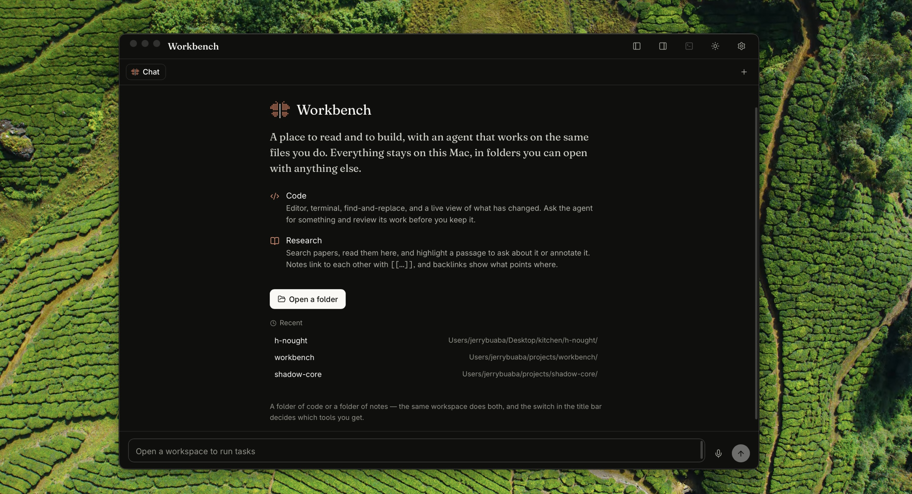

# Workbench

A place to read and to build, with an agent that works on the same files you do.
Everything stays on your Mac, in folders you can open with anything else.



Two modes over one folder, switched in the title bar:

**Code** — editor with conflict-aware saving, a real terminal with tabs and splits,
find-and-replace across the project, a live side-by-side view of uncommitted changes,
and an agent whose work you review before you keep it.

**Research** — search ~250M papers, read them in-app, highlight a passage to ask
about it or annotate it. Notes link with `[[wikilinks]]` and backlinks show what
points where.

Built for personal use, so it is opinionated. It is also honest about what it
stores: notes are markdown, papers are markdown with the PDF beside them, and
nothing lives in a private database that would strand you if this app went away.

---

## Requirements

This has only been built and used on **Apple Silicon macOS**. Nothing pins the
architecture, but Intel is untested.

| | Needed | Why |
|---|---|---|
| Xcode Command Line Tools | `xcode-select --install` | Rust needs a linker |
| **Rust ≥ 1.85, via rustup** | `curl --proto '=https' --tlsv1.2 -sSf https://sh.rustup.rs \| sh` | see the warning below |
| Node ≥ 20 | `brew install node` | built on 23.4 |
| prime-agent | `npm install -g prime-agent` | the coding agent Workbench drives |

> **Install Rust with rustup, not Homebrew.**
> Homebrew's `cargo` was 1.84.1 at time of writing, which predates the
> `edition2024` feature some dependencies require. The build fails with a bare
> `failed to build app` that names no cause. If you already have Homebrew's
> Rust, install rustup as well — the build script puts `~/.cargo/bin` first, so
> both can coexist.

Check what you have:

```bash
cargo --version        # must be 1.85 or newer
node --version
prime-agent --version
```

---

## Build and install

```bash
git clone https://github.com/buabaj/workbench.git
cd workbench
npm install
npm run ship
```

`ship` quits any running copy, removes stale bundles and Launch Services
registrations, builds, installs to `/Applications`, and verifies the installed
binary hashes equal to the one just built. The first Rust build takes a few
minutes; later ones are about two.

If you would rather not install to `/Applications`:

```bash
npm run tauri build
open src-tauri/target/release/bundle/macos/Workbench.app
```

The app is **ad-hoc signed** — there is no Developer ID. macOS will warn on
first launch: right-click the app → **Open** → **Open**. Because each rebuild
looks like a new app, the Keychain re-prompts for credentials after one.

### Development

```bash
npm run tauri dev   # hot reload
npm test            # frontend tests
cd src-tauri && cargo test
```

---

## Connecting a model

Workbench does not ship credentials. Open **Settings (⌘,) → Providers** and pick
one of two routes.

### Use a subscription you already pay for (recommended)

prime-agent can authenticate against a ChatGPT Plus/Pro or Claude subscription,
so work is not billed twice. In a terminal:

```bash
prime-agent
```

then `/login` and choose your subscription. It appears in Workbench under
**Providers → On this Mac** as an OAuth session — click **Use**. Tokens stay
where prime-agent put them; Workbench never copies them.

### Or paste an API key

Choose a provider, paste a key, save. Keys go to the macOS Keychain, and each
agent run gets an isolated config directory so one credential cannot reach
another provider.

> **Pick a model.** After connecting, click **Models** and choose one. Left
> unset, the agent takes whatever the provider lists first — which on OpenAI is
> `gpt-4`, whose 8k context window cannot hold a source file and a conversation
> at once. The list shows context window and price, with a recommendation
> marked.

---

## Optional: `.env` for the built-in helpers

Voice transcription, conversation titles, and `@agent[…]` in notes use a small
model directly rather than the coding agent. They need an
[OpenRouter](https://openrouter.ai) key:

```bash
mkdir -p ~/.config/workbench
echo 'OPENROUTER_API_KEY=sk-or-v1-…' > ~/.config/workbench/.env
```

`~/.config/workbench/.env` applies to every workspace. A `.env` in a workspace
root also works and takes precedence, which is useful for keeping a project's
usage separate. Everything else works without this; you simply lose those three
features.

Only `OPENROUTER_API_KEY` is ever read from `.env`, and the file is zeroized
after parsing so the rest of its contents do not linger in memory.

---

## Using it

**Open a folder.** Any folder — a codebase, a notes vault, or both. The mode
switch decides which tools you get.

**Code mode.** ⌘P opens a file, ⇧⌘F searches the project, ⌃\` or ⌘⇧T toggles
the terminal, ⌘S saves. `@` in the chat references a file; highlight code and a
bubble offers to send it to the agent. The **Changes** tab lists uncommitted
work and opens diffs side by side. There is no stage or commit — that stays in
the terminal, where you already do it.

**Research mode.** **Find papers** searches OpenAlex; adding one writes a
markdown note with the metadata, abstract and extracted full text, and downloads
the PDF when it is open access. Toggle **PDF** on a paper note to read it.
Highlight a passage to ask the agent about it or annotate it — annotations are
saved into the note and marked in the page's margin. Type `[[` in any note to
link to another, and **Backlinks** shows both directions.

**`@agent[…]`** written inside a note runs on ⌘↵ and is replaced by the answer.
Generated prose is **marked** in the file so it never becomes indistinguishable
from your own writing — see below.

### Provenance

Text a model wrote is wrapped in HTML comments recording which model and when:

```markdown
<!-- agent deepseek/deepseek-v4-flash 2026-08-08 -->
The reward model is trained on preference pairs sampled from the policy.
<!-- /agent -->
```

Invisible wherever markdown is rendered, so the note still reads normally in
Obsidian — but Workbench shows it with a clay rule while you write, and a bar
above the editor counts how much of the note you have not verified.

**Accept** strips the markers: you have read it, checked it, and stand behind
it, so it becomes yours. Never automatic. The distinction the file records is
"verified by me" against "asserted by a model", which is the distinction that
matters when you cite it.

### Shortcuts

| | |
|---|---|
| `⌘P` | open a file by name |
| `⇧⌘F` | find in files |
| `⌘L` | jump back to the chat |
| `⌘S` | save |
| `⌘↵` | run the `@agent[…]` nearest the cursor |
| `⌃\`` or `⌘⇧T` | show/hide the terminal (the shell keeps running) |
| `⌘B` / `⌥⌘B` | left rail / right inspector |
| `⌘⇧V` | start or stop dictation |
| `⌘⇧]` `⌘⇧[` | next / previous tab |
| `⌘W` | close tab |
| `⌘,` | settings |

---

## How your data is stored

- **Notes and papers** — markdown in your folder. `papers/` holds one note per
  paper; `papers/pdf/` holds the files. Open them in Obsidian or anything else.
- **Conversations, checkpoints and settings** — SQLite at
  `~/Library/Application Support/co.morpheusgh.workbench/`.
- **Credentials** — macOS Keychain, or wherever prime-agent keeps its OAuth
  tokens. Never in the database, never in the repo.
- **Agent checkpoints** — a shadow git object database, so your `.git` is never
  written to by a review or a restore.

---

## Known gaps

- No Developer ID signing, so Gatekeeper warns and the Keychain re-prompts after
  each rebuild.
- No graph view for the note vault; backlinks are a list.
- Three capabilities appear in Settings but are not implemented:
  `transcript.cleanup`, `research.summarize`, `links.suggest`.
- Untested on Intel Macs and on anything but macOS.

---

## Licence

[MIT](LICENSE) — use it, fork it, build on it. Keep the copyright notice.

Bundled third-party components and their notices are listed in
[THIRD-PARTY-LICENSES.md](THIRD-PARTY-LICENSES.md). Note that `libgit2` is
vendored under GPL-2.0 **with** the linking exception, which is what permits
linking it from an MIT project.
